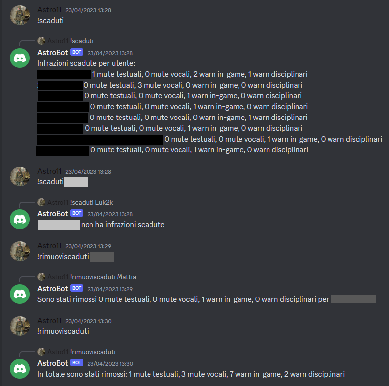
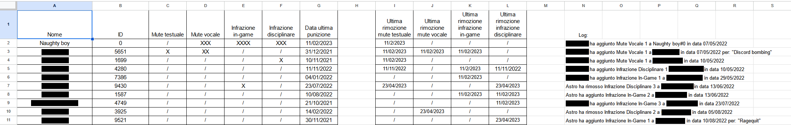

# DiscordModerationBot

This bot was created to help staff in my Discord to keep track of user offences. In our ruleset we divide offences in 4 types: text mutes, voice mutes, in-game warns, disciplinary warns. They each have different duration, different implications and multiple levels of severity (first, second, final offence). The bot keeps track of these in a Google Spreadsheet (the NaughtyList) which registers the username and the ID of the offending user, the type and severity of the offence, the date of the offence and the last time an offence was removed. This allows the bot to automatically remove offences from the database after their expiration (for example, 4 months). It also gives the offending users appropriate roles on the Discord server reflecting their situation (for example In-Game Warn 1 or TextMute 3). Staff members can interact with the bot through the use of slash commands on Discord (all their interactions are logged in the Spreadsheet):

- !status [Mention/Name]                                           (Lists user offences)
- !add [[Mention/Name]                                             (Add a user to the NaughtyList)
- !delete [Name/ID]                                                (Removes a user from the NaughtyList)
- !edit [Name/ID] [NewName] [NewID]                                (Modifies a user in the NaughtyList)
- !disciplinare [Mention/Name]                                     (Adds a disciplinary warn to a user)
- !ingame [Mention/Name]                                           (Adds an in-game warn to a user)
- !testuale [Mention/Name]                                         (Adds a text mute to a user)
- !vocale [Mention/Name]                                           (Adds a voice mute to a user)
- !remove [Mention/Name] [disciplinare/ingame/testuale/vocale]     (Removes the specified offence)
- !scaduti [Mention/Name]                                          (Lists all the expired offences of a user)
- !scaduti                                                         (Lists all the expired offences of all users)
- !rimuoviScaduti [Mention/Name]                                   (Removes all expired offences from a user)
- !rimuoviScaduti                                                  (Removes all expired offences from all users)
- !sistemaRuoli [Mention/Name]                                     (Makes sure the user has the appropriate warn roles on Discord)
- !sistemaRuoli                                                    (Makes sure all the the users have the appropriate warn roles on Discord)

Use of commands:

Spreadsheet Database:

